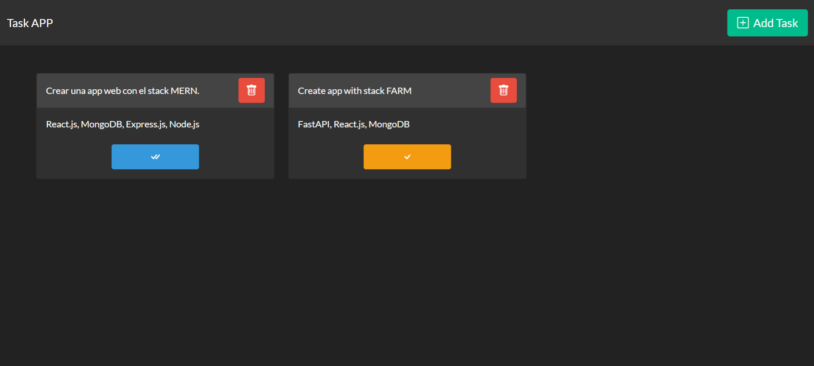
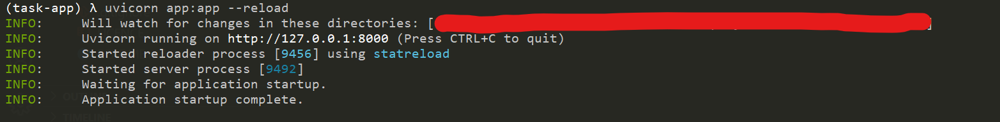

# APP TASK (FastAPI + React.js + MongoDB + Redux + Boostwatch + React Router Dom)

## Requirements with REST API 
- Anaconda or other enviroment 
- fastapi
- pydantic
- pymongo
- python-dotenv
- starlette
- MongoDB
- REST CLIENT (extension for vscode)
## Requirements with Web App
- Node Js 14v
- NPM 6.14v

## Screenshot:
- App web:

- REST API:

